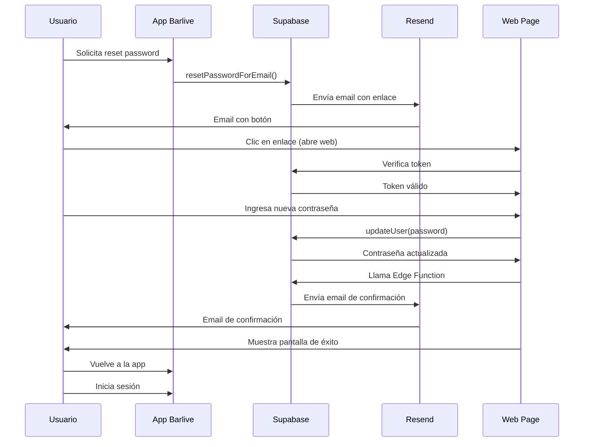

# 🔐 Sistema Completo de Restablecimiento de Contraseña v6.0

## 📋 Descripción General

Este documento describe el flujo completo y mejorado de restablecimiento de contraseña para Barlive, implementando las mejores prácticas de seguridad y UX.

## 🎯 Características Principales

### ✅ Seguridad
- No revela si un email existe en el sistema
- Enlaces de recuperación con expiración de 1 hora
- Validación de contraseña en tiempo real
- Correo de confirmación automático después del cambio
- Indicadores visuales de requisitos de contraseña

### ✅ Experiencia de Usuario
- Diseño moderno y responsive
- Mensajes claros y amigables
- Instrucciones paso a paso
- Feedback visual inmediato
- Página web personalizada para restablecer contraseña

### ✅ Flujo Completo
1. Usuario solicita restablecimiento desde la app
2. Recibe correo con enlace seguro
3. Abre página web personalizada
4. Ingresa nueva contraseña con validación en tiempo real
5. Recibe correo de confirmación
6. Vuelve a la app para iniciar sesión

---

## 🚀 Configuración Paso a Paso

### 1️⃣ Configurar Plantilla de Email en Supabase

1. Ve a tu proyecto en Supabase Dashboard
2. Navega a **Authentication** → **Email Templates**
3. Selecciona **Reset Password**
4. Copia el contenido del archivo `docs/EMAIL_TEMPLATE_PASSWORD_RESET_V6.html`
5. Pégalo en el editor de Supabase
6. **IMPORTANTE**: Asegúrate de que la variable `{{ .ConfirmationURL }}` esté presente
7. Guarda los cambios

### 2️⃣ Configurar URL de Redirección en Supabase

1. En Supabase Dashboard, ve a **Authentication** → **URL Configuration**
2. Agrega la siguiente URL a **Redirect URLs**:
   ```
   https://barliveapp.es/auth/reset-password-web
   ```
3. Asegúrate de que tu **Site URL** sea:
   ```
   https://barliveapp.es
   ```
4. Guarda los cambios

### 3️⃣ Desplegar Edge Function

1. Asegúrate de tener Supabase CLI instalado:
   ```bash
   npm install -g supabase
   ```

2. Inicia sesión en Supabase:
   ```bash
   supabase login
   ```

3. Vincula tu proyecto:
   ```bash
   supabase link --project-ref embntaqwlwmgazvrglaf
   ```

4. Configura el secreto de Resend:
   ```bash
   supabase secrets set RESEND_API_KEY=tu_api_key_de_resend
   ```

5. Despliega la función:
   ```bash
   supabase functions deploy send-password-change-confirmation
   ```

### 4️⃣ Configurar Resend (Servicio de Emails)

1. Ve a [Resend.com](https://resend.com) y crea una cuenta
2. Verifica tu dominio `barliveapp.es`:
   - Ve a **Domains** → **Add Domain**
   - Agrega `barliveapp.es`
   - Copia los registros DNS que te proporciona Resend
   - Agrégalos en tu proveedor de DNS (IONOS, Cloudflare, etc.)
   - Espera a que se verifique (puede tomar hasta 48 horas)

3. Crea una API Key:
   - Ve a **API Keys** → **Create API Key**
   - Copia la key y guárdala de forma segura
   - Esta es la key que usaste en el paso 3.4

### 5️⃣ Actualizar Rutas en la App

1. Actualiza el archivo `_redirects` en la raíz del proyecto:
   ```
   /auth/reset-password-web /auth/reset-password-web.html 200
   /auth/recuperar-password-v6 /auth/recuperar-password-v6.html 200
   ```

2. Si usas Netlify/Vercel, asegúrate de que las rutas estén configuradas correctamente

---

## 📱 Uso del Sistema

### Para Usuarios

#### 1. Solicitar Restablecimiento
1. En la pantalla de login, presiona "¿Olvidaste tu contraseña?"
2. Ingresa tu correo electrónico
3. Presiona "Enviar enlace de recuperación"
4. Verás un mensaje genérico (por seguridad)

#### 2. Revisar Email
1. Abre tu correo electrónico
2. Busca el correo de Barlive (revisa spam si no lo ves)
3. Haz clic en el botón "Restablecer mi contraseña"

#### 3. Crear Nueva Contraseña
1. Se abrirá una página web
2. Ingresa tu nueva contraseña
3. Confirma la contraseña
4. Verás indicadores en tiempo real de los requisitos
5. Presiona "Guardar nueva contraseña"

#### 4. Confirmación
1. Verás una pantalla de éxito
2. Recibirás un correo de confirmación
3. Cierra la página web
4. Vuelve a la app Barlive
5. Inicia sesión con tu nueva contraseña

### Para Desarrolladores

#### Archivos Principales

```
app/auth/
├── recuperar-password-v6.tsx          # Pantalla inicial (solicitar reset)
└── reset-password-web.tsx             # Página web para ingresar nueva contraseña

supabase/functions/
└── send-password-change-confirmation/ # Edge Function para correo de confirmación
    └── index.ts

docs/
├── EMAIL_TEMPLATE_PASSWORD_RESET_V6.html  # Plantilla del correo de reset
└── PASSWORD_RESET_FLOW_V6_SETUP.md        # Este documento
```

#### Flujo Técnico



---

## 🔍 Solución de Problemas

### El correo no llega

**Posibles causas:**
1. El dominio no está verificado en Resend
2. El correo está en spam
3. La API key de Resend no está configurada

**Solución:**
1. Verifica el estado del dominio en Resend
2. Revisa los logs de Supabase:
   ```bash
   supabase functions logs send-password-change-confirmation
   ```
3. Verifica que la API key esté configurada:
   ```bash
   supabase secrets list
   ```

### El enlace dice "expirado"

**Causa:** Los enlaces expiran después de 1 hora por seguridad.

**Solución:** Solicita un nuevo enlace desde la app.

### La página web no carga

**Posibles causas:**
1. La ruta no está configurada correctamente
2. El archivo no se desplegó

**Solución:**
1. Verifica que el archivo `reset-password-web.tsx` exista
2. Verifica las rutas en `_redirects`
3. Redespliega la aplicación

### No se envía el correo de confirmación

**Causa:** El Edge Function no está desplegado o tiene errores.

**Solución:**
1. Verifica que la función esté desplegada:
   ```bash
   supabase functions list
   ```
2. Revisa los logs:
   ```bash
   supabase functions logs send-password-change-confirmation
   ```
3. Redespliega si es necesario

---

## 📊 Métricas y Monitoreo

### Eventos a Monitorear

1. **Solicitudes de reset**: Cuántos usuarios solicitan restablecer contraseña
2. **Emails enviados**: Tasa de éxito de envío de emails
3. **Enlaces abiertos**: Cuántos usuarios abren el enlace
4. **Contraseñas actualizadas**: Tasa de conversión completa
5. **Errores**: Cualquier error en el flujo

### Logs Importantes

```typescript
// En recuperar-password-v6.tsx
console.log('[RecuperarPasswordV6] 📧 Email normalizado:', email);
console.log('[RecuperarPasswordV6] ✅ CORREO ENVIADO EXITOSAMENTE');

// En reset-password-web.tsx
console.log('[ResetPasswordWeb] ✅ Sesión establecida para:', email);
console.log('[ResetPasswordWeb] ✅ Contraseña actualizada');

// En Edge Function
console.log('[PasswordChangeConfirmation] ✅ Correo enviado');
```

---

## 🎨 Personalización

### Colores del Email

Los colores están definidos inline en el HTML. Para cambiarlos:

1. Abre `docs/EMAIL_TEMPLATE_PASSWORD_RESET_V6.html`
2. Busca los colores:
   - Gradiente header: `#667eea` → `#764ba2`
   - Botón principal: `#667eea`
   - Éxito: `#10b981`
   - Advertencia: `#f59e0b`
   - Error: `#ef4444`
3. Reemplaza con tus colores de marca
4. Actualiza en Supabase Dashboard

### Textos y Mensajes

Todos los textos están en español y pueden personalizarse:

1. En la app: Edita los archivos `.tsx`
2. En los emails: Edita el HTML en Supabase Dashboard
3. Mantén la consistencia de tono y marca

---

## ✅ Checklist de Implementación

- [ ] Plantilla de email configurada en Supabase
- [ ] URL de redirección agregada en Supabase
- [ ] Dominio verificado en Resend
- [ ] API Key de Resend configurada en Supabase
- [ ] Edge Function desplegada
- [ ] Archivos de la app actualizados
- [ ] Rutas configuradas en `_redirects`
- [ ] Prueba completa del flujo realizada
- [ ] Documentación revisada
- [ ] Equipo capacitado en el nuevo flujo

---

## 📞 Soporte

Si tienes problemas con la implementación:

1. Revisa los logs de Supabase
2. Verifica la configuración de Resend
3. Consulta este documento
4. Contacta al equipo de desarrollo

---

## 🔄 Actualizaciones Futuras

### Posibles Mejoras

1. **Autenticación de dos factores (2FA)**
   - Agregar código de verificación por SMS
   - Usar apps de autenticación (Google Authenticator)

2. **Historial de cambios**
   - Registrar todos los cambios de contraseña
   - Mostrar dispositivos y ubicaciones

3. **Notificaciones push**
   - Alertar al usuario en la app cuando se cambia la contraseña
   - Permitir revocar sesiones activas

4. **Análisis de seguridad**
   - Detectar contraseñas débiles comunes
   - Sugerir contraseñas seguras
   - Verificar si la contraseña ha sido comprometida (Have I Been Pwned)

---

## 📝 Notas Finales

Este sistema implementa las mejores prácticas de seguridad y UX para el restablecimiento de contraseñas. Es importante mantenerlo actualizado y monitorear su funcionamiento regularmente.

**Recuerda:**
- Nunca reveles si un email existe en el sistema
- Los enlaces deben expirar rápidamente
- Siempre envía confirmaciones de cambios de seguridad
- Mantén los logs para auditoría
- Prueba el flujo completo regularmente

---

**Versión:** 6.0  
**Última actualización:** 2 de febrero de 2025  
**Autor:** Equipo de Desarrollo Barlive
